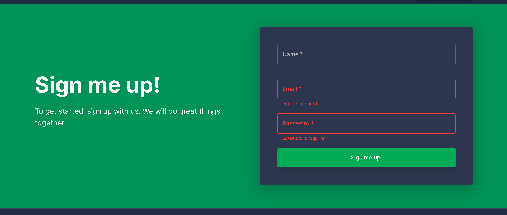

# 🚀 My Web App

This project was created as I started to think of our "next great idea" for a cloud service app. I wantd to get all of the common tasks done that are needed for any web application. Things like basic structure, login, security, sign-up, user management, etc. The work is progressing slow but steady and we are in a good place to start showing some value and seeing if others are wiling to contribute.

# Basic architecture

There are 3 main components to the application so far.

- My Web App
- Identity Service
- Admin Service

### My Web App

This is built using the [Webbee - Multipurpose Template + UI Kit](https://webbee.maccarianagency.com/). The template is built in React and is based on Material-UI design. It is mix of JavaScript and TypeScript files. It is the front end of the service and communicates via REST endpoints back to the microservices.

> _please make sure you check the [licensing terms](https://mui.com/store/license/#i-standard-license) when using this template. If you have questions, you can [contact them via email](hi@maccarianagency.com)._

### Identity Service

The Identity Service is a set of REST API's and SQL database that manages all the login, authorization, and sign-up workflows. This repo is currently private.

### Admin Service

The Admin Service is also a set of REST API's that sit on top of the Identity Service database. It currently handles admin specific tasks like users, sessions, and code management.

[Link to admin service repository](https://github.com/danhellem/myapp-adminservice)

### User Service

For basic user management tasks

### Course Service

For all course management admin tasks

###

# Getting started

- Install Node v14 (newer versions will not work)
- Install dependencies: `yarn install`
- Start the server: `yarn start`

When the page loads, you can create a new account by scrolling down to the "Sign me up!" section.

If you run into any problems in the workflow, please post an issue and we will respond ASAP.

# How to contribute

If you are interested in contributing, please crete a new issue and we will get back to you.

## Quick start

- Install dependencies: `yarn install`
- Start the server: `yarn start`
- Build on production: `yarn build`

## MUI Documentation

The full documentation for the React Material Kit can be found [here](https://next.material-ui.com?ref=maccarian-agency)

#react #samplecode #codesamples #webapp #reactapp #hobbie #startup
